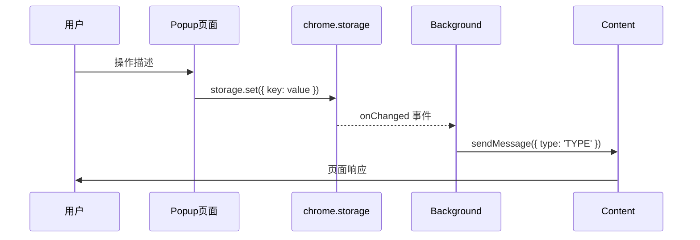

# 功能名称：[Feature Name]

## 概览

| 字段 | 内容 |
|------|------|
| 状态 | 设计中 / 开发中 / 已完成 |
| 最后更新 | YYYY-MM-DD |
| 涉及文件数 | N 个 |
| 涉及层 | Popup / Background / Content / Storage |

---

## 入口链路

| 步骤 | 位置 | 文件 | 行为 |
|------|------|------|------|
| 1 | UI 触发 | `src/popup/components/xxx.tsx` | 用户点击... |
| 2 | 路由跳转 | `src/popup/router/index.tsx` | → /route-path |
| 3 | 页面渲染 | `src/popup/pages/xxx.tsx` | 渲染表单/界面 |

---

## 文件职责表

| 文件 | 层 | 职责 | Storage Key |
|------|----|------|-------------|
| `src/popup/pages/xxx.tsx` | Popup | 配置页面，读写 storage | `key_name` |
| `src/background/xxx.ts` | Background | 核心业务逻辑 | - |
| `src/content/hooks/useXxx.ts` | Content | 触发检测、通知发送 | - |

---

## Storage 数据结构

```typescript
// key: 'storage_key_name'
interface XxxData {
  field1: string;
  field2: number;
  enabled: boolean;
}
```

---

## 消息类型（Message Bus）

| 消息类型 | 发送方 | 接收方 | 说明 |
|---------|--------|--------|------|
| `MESSAGE_TYPE` | Content | Background | 触发通知 |
| `ANOTHER_TYPE` | Background | Content | 推送数据 |

---

## 数据流时序图 [实现版 / 设计版]



---

## 已知问题 / 待优化

- [ ] 待补充
