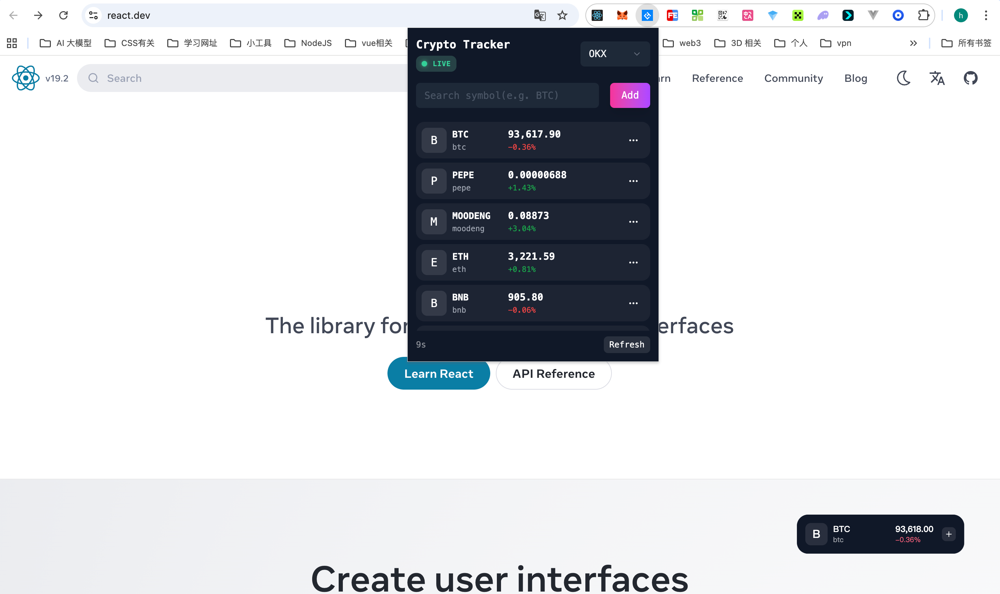
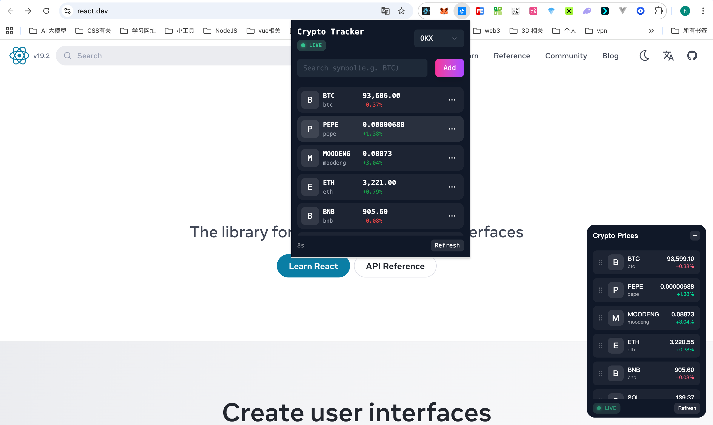

<div align="right">

[English](README.md) | [中文](README.zh-CN.md)

</div>

# Crypto Tracker

<p align="center">
  
</p>

<p align="center">
  <strong>A Real-time Cryptocurrency Price Tracking Chrome Extension</strong>
</p>

<p align="center">
  Real-time Prices · Floating Widget · Custom Tracking
</p>

---

## 📖 Project Overview

**Crypto Tracker** is a browser extension developed based on Chrome Extension Manifest V3, providing real-time cryptocurrency price tracking functionality. It supports multiple exchange data sources (OKX, BN, Gate), obtains real-time market data through WebSocket connections, displays floating price widgets on any webpage, and provides price alert features, keeping you informed of market dynamics at all times.

## ✨ Core Features

### 🎯 Real-time Price Tracking

- Support for multiple data source switching (OKX, Gate, BN and other exchanges)
- Obtain real-time price data through WebSocket connections
- Support for 300+ cryptocurrencies (BTC, ETH, SOL, BNB, etc.)
- Display daily price changes (calculated based on UTC+8 opening price)
- Automatic price updates, no manual refresh required
- Real-time display of data connection status (LIVE/DEGRADED/OFFLINE)

### 🔲 Floating Widget

- Display draggable floating window on any webpage
- Support expand/collapse modes
- Display real-time price of the first coin when collapsed
- Display complete tracking list when expanded
- Support drag-and-drop sorting to adjust coin display order
- Automatic edge snapping to screen edges
- Auto-hide on mobile devices for optimized mobile experience

### 📌 Popup Window

- Click extension icon to open management panel
- Search and add new tracking coins
- Remove unwanted coins
- Manual data refresh
- 10-second auto-refresh countdown
- Switch data sources (supports multiple exchanges)
- Set price alerts (upper/lower limits)

### 🛡️ Smart Network Detection

- Automatically detect user network environment (Mainland China/Overseas)
- Use local cache for coin validation on mainland networks
- Directly call OKX API for validation on overseas networks

### 🔔 Price Alert Feature

- Support setting upper/lower price alerts for each coin
- Automatically display Toast notifications when price triggers
- Support enable/disable alert functionality
- Smart throttling to avoid frequent notifications

### 🔄 Stable Connection Mechanism

- WebSocket automatic reconnection on disconnection
- WebSocket dead connection detection and automatic recovery
- User idle state detection (auto-disconnect on lock screen, auto-reconnect on unlock)
- Data stagnation detection and automatic refresh
- Automatic synchronization of latest data when page is visible

## 🛠️ Tech Stack

| Technology            | Purpose                      |
| --------------------- | ---------------------------- |
| **React 19**          | UI Framework                 |
| **TypeScript**        | Type Safety                  |
| **Vite 7**            | Build Tool                   |
| **Tailwind CSS 4**    | Styling Framework            |
| **Framer Motion**     | Animation Effects            |
| **SWR**               | Data Fetching & Caching      |
| **@dnd-kit**          | Drag-and-Drop Sorting        |
| **Big.js**            | Precise Numeric Calculation  |
| **CRXJS Vite Plugin** | Chrome Extension Development |
| **WebSocket API**     | Real-time Market Data        |

## 🚀 Quick Start

### Requirements

- Node.js >= 18
- npm >= 9
- Chrome Browser

### Install Dependencies

```bash
npm install
```

### Development Mode

```bash
npm run dev
```

### Load Extension

1. Open Chrome browser and visit `chrome://extensions/`
2. Enable "Developer mode" in the top right corner
3. Click "Load unpacked"
4. Select the `dist` directory of the project

### Production Build

```bash
npm run build
```

After building, the `dist` directory contains the publishable extension files.

### Package for Release

```bash
npm run build_sh
```

This will generate a `.zip` release package in the `release` directory.

## 📝 Usage Guide

### Add Tracking Coins

1. Click the extension icon in the browser toolbar
2. Enter coin symbol in the search box (e.g., `BTC`, `ETH`)
3. Click the "Add" button or press Enter
4. Coin will be automatically added to the list after successful validation

### Remove Tracking Coins

- In the Popup list, click the "Remove" button on the right side of the coin
- Note: At least one tracking coin must be retained

### Floating Widget Operations

- **Drag**: Hold the widget header to freely drag
- **Expand/Collapse**: Click the +/- button in the top right corner
- **Sort**: After expanding, hold the drag handle on the left side of the coin and drag up/down to adjust order
- **Refresh**: After expanding, click the "Refresh" button at the bottom

### Set Price Alerts

1. In the Popup window, click the "···" menu on the right side of the coin
2. Select "Price Alert"
3. Set target price and direction (Above/Below)
4. Click "Save" to save
5. When the price triggers the alert, a Toast notification will be automatically displayed

### Switch Data Source

1. In the top right corner of the Popup window, click the data source dropdown
2. Select different exchanges (OKX, Gate, BN)
3. The system will automatically switch WebSocket connections
4. Note: Some data sources require VPN to access

## ⚙️ Configuration

### manifest.config.ts

```typescript
{
  manifest_version: 3,
  name: 'Crypto Tracker',
  permissions: ['storage', 'alarms', 'activeTab', 'scripting', 'idle'],
  host_permissions: ['https://www.okx.com/*', 'https://ipapi.co/*']
}
```

### Permission Description

| Permission  | Purpose                        |
| ----------- | ------------------------------ |
| `storage`   | Store user's tracked coin list |
| `alarms`    | Scheduled tasks (reserved)     |
| `activeTab` | Send messages to current tab   |
| `scripting` | Inject content scripts         |
| `idle`      | Detect user idle state         |

## 📊 Data Flow

```
┌─────────────────────────────────────────────────────────────────┐
│                        Background Script                         │
│  ┌─────────────┐    ┌─────────────┐    ┌─────────────────────┐  │
│  │   Storage   │───▶│  WebSocket  │───▶│  Price Processing   │  │
│  │  (coins,    │    │  (Multi     │    │  (updateTokenList)  │  │
│  │   data_     │    │   Exchange) │    │  + Alert Check)     │  │
│  │   source,   │    │             │    └──────────┬──────────┘  │
│  │   alerts)   │    └─────────────┘              │             │
│  └─────────────┘                                  │             │
│                                                    │             │
│  ┌────────────────────────────────────────────────┘             │
│  │  - Support multi-data source switching (OKX/Gate/BN)        │
│  │  - WebSocket dead connection detection & auto-reconnect      │
│  │  - Price alert trigger detection                             │
│  └──────────────────────────────────────────────────────────────┘
└───────────────────────────────────────────────────┼─────────────┘
                                                    │
                          chrome.tabs.sendMessage   │
                                                    ▼
┌─────────────────────────────────────────────────────────────────┐
│                        Content Script                            │
│  ┌─────────────────────────────────────────────────────────┐    │
│  │              FloatingCryptoWidget (App.tsx)              │    │
│  │  - Listen to UPDATE_PRICE messages                       │    │
│  │  - Listen to DATA_STATUS_CHANGE messages                │    │
│  │  - Render real-time prices                              │    │
│  │  - Draggable floating widget                            │    │
│  │  - Support drag-and-drop sorting                        │    │
│  │  - Price alert Toast notifications                       │    │
│  └─────────────────────────────────────────────────────────┘    │
└─────────────────────────────────────────────────────────────────┘

┌─────────────────────────────────────────────────────────────────┐
│                          Popup Script                            │
│  ┌─────────────────────────────────────────────────────────┐    │
│  │                PopupContent.tsx                          │    │
│  │  - Send GET_LATEST_PRICES to fetch data                 │    │
│  │  - Add/remove coins                                     │    │
│  │  - Switch data sources                                  │    │
│  │  - Set price alerts                                     │    │
│  │  - Manual refresh                                       │    │
│  └─────────────────────────────────────────────────────────┘    │
└─────────────────────────────────────────────────────────────────┘
```

## 🎨 UI Preview

### Popup Window

- Dark theme design
- Display coin icon, symbol, price, price change
- Support search, add and remove coins

<p align="center">
  
</p>

### Floating Widget

- Rounded card design
- Glassmorphism background effect
- Smooth expand/collapse animations
- Support drag-and-drop coin sorting
- Automatic edge snapping to screen
- Real-time network connection status display

<p align="center">
  
</p>

## 📄 License

This project is for learning and communication purposes only.

---

<p align="center">
  Made with ❤️ for Crypto Enthusiasts
</p>
