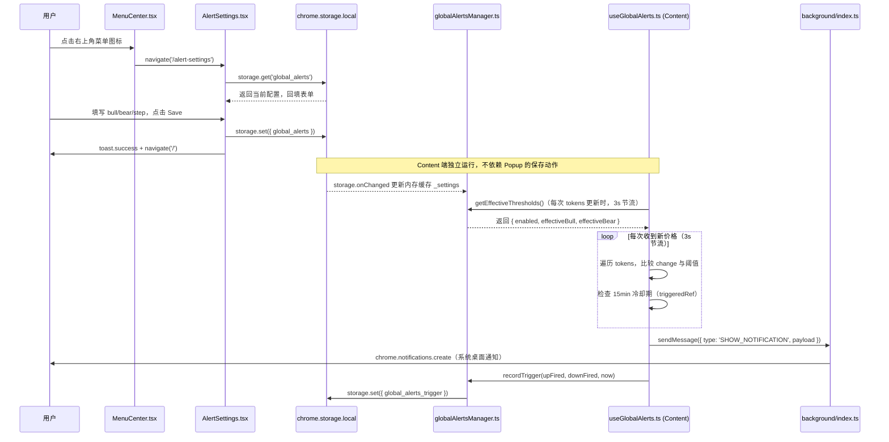

# 功能名称：全局预警 (Global Price Monitor)

## 概览

| 字段 | 内容 |
|------|------|
| 状态 | 已完成 |
| 最后更新 | 2026-04-28 (rev2) |
| 涉及文件数 | 6 个 |
| 涉及层 | Popup / Background / Content / Storage |

---

## 入口链路

| 步骤 | 位置 | 文件 | 行为 |
|------|------|------|------|
| 1 | UI 触发 | `src/popup/components/MenuCenter.tsx` | 右上角 `<Menu>` 图标点击，展开 ActionMenu |
| 2 | 菜单项点击 | `src/popup/components/MenuCenter.tsx:97` | 点击 "Global Price Monitor" → `navigate('/alert-settings')` |
| 3 | 路由匹配 | `src/popup/router/index.tsx:14` | Hash 路由 `/alert-settings`，lazy 加载 AlertSettings |
| 4 | 页面初始化 | `src/popup/pages/AlertSettings.tsx:109` | `useEffect` 读取 `chrome.storage.local` → `global_alerts`，回填表单 |
| 5 | 用户提交 | `src/popup/pages/AlertSettings.tsx:122` | 点击 Save → `saveGlobalSettings()` |
| 6 | 写入 Storage | `src/popup/pages/AlertSettings.tsx:132` | `chrome.storage.local.set({ global_alerts: { bull, bear, step, enabled } })` |
| 7 | 返回首页 | `src/popup/pages/AlertSettings.tsx:134` | 1s 后 `navigate('/')` |

---

## 文件职责表

| 文件 | 层 | 职责 | Storage Key |
|------|----|------|-------------|
| `src/popup/components/MenuCenter.tsx` | Popup | 菜单入口，导航至预警配置页 | - |
| `src/popup/router/index.tsx` | Popup | 路由定义，lazy 加载 AlertSettings | - |
| `src/popup/pages/AlertSettings.tsx` | Popup | 预警配置页面，通过 `globalAlertsManager` 读写 global_alerts | `global_alerts` |
| `src/background/globalAlertsManager.ts` | Background/Content 共享 | settings 和 trigger 的缓存、读写、衰减计算；对外暴露 `loadGlobalAlerts` / `saveGlobalAlerts` / `initGlobalAlertsOnInstall` | `global_alerts` / `global_alerts_trigger` |
| `src/content/hooks/useGlobalAlerts.ts` | Content | 监听价格变化，与阈值比较，触发通知 | - |
| `src/background/badge.ts` | Background | （保留）收到 `ALERT_TRIGGERED` 消息时更新图标 Badge | - |

---

## Storage 数据结构

```typescript
// key: 'global_alerts'（由 AlertSettings 写入，globalAlertsManager 读取）
interface GlobalAlerts {
  bull: string;     // 涨幅预警阈值，如 "10"（百分比）
  bear: string;     // 跌幅预警阈值，如 "5"（百分比）
  step: string;     // 追踪模式步长，如 "1"（每次触发后阈值递增）
  enabled: boolean; // 是否启用
}

// key: 'global_alerts_trigger'（由 globalAlertsManager 维护）
interface GlobalAlertsTrigger {
  upCount: number;      // 上涨触发次数（用于计算有效阈值）
  downCount: number;    // 下跌触发次数
  lastTriggerAt: number; // 最后触发时间戳（ms）
  lastDecayAt: number;  // 最后衰减时间戳（ms）
}
```

---

## 阈值衰减逻辑

`globalAlertsManager.ts` 中的 `calcDecay()` 纯函数：

- **24h 未触发** → `upCount = downCount = 0`（归零）
- **每 8h 衰减** → `upCount - 1`，`downCount - 1`（最小为 0）
- 有效阈值 = 基础阈值 + `step × count`（追踪模式）

---

## 消息类型

| 消息类型 | 发送方 | 接收方 | 说明 |
|---------|--------|--------|------|
| `SHOW_NOTIFICATION` | Content (`useGlobalAlerts`) | Background (`index.ts`) | 触发系统桌面通知（当前唯一启用的预警通道） |
| `ALERT_TRIGGERED` | ——（保留，暂未使用）| Background | 预留：设置图标 Badge 为红色警示，当前 Content 侧无发送调用 |
| `ALERT_CLEAR` | ——（保留，暂未使用）| Background | 预留：清除图标 Badge，当前 Content 侧无发送调用 |

---

## 数据流时序图 [实现版]



---

## 已知问题 / 待优化

- [x] `AlertSettings.tsx` 直接调用 `chrome.storage.local`，未通过统一的 storage 模块  
  → 已修复：改为调用 `globalAlertsManager.loadGlobalAlerts()` / `saveGlobalAlerts()`
- [x] `useGlobalAlerts.ts` 的 `initGlobalAlertsCache()` 调用被注释，cache 未在 content script mount 时初始化  
  → 已修复：取消注释，content 挂载时正确初始化内存缓存
- [x] `background/index.ts` 的初始化逻辑（原 `initTriggerCount`）被注释，且仅初始化 trigger，未初始化 `global_alerts`  
  → 已修复：重命名为 `initGlobalAlertsOnInstall()`，在 `onInstalled` 中同时写入 `global_alerts`（默认值）和 `global_alerts_trigger`（默认值）
- [ ] `ALERT_TRIGGERED` / `ALERT_CLEAR` 为保留功能，暂未在 Content 侧发送，Badge 更新路径待后续实现
